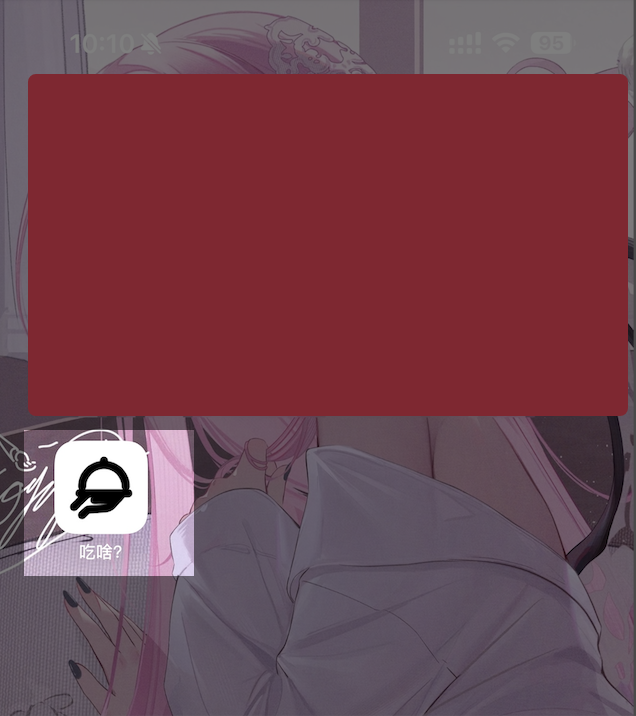

<h1 align="center">
    
    
Eat what

</h1>

    <b>
        <i>吃啥？今天早上/中午/晚上吃啥？</i>
    </b>

> [!IMPORTANT]
> 本网页功能已转移到我的博客: https://blog.vince-g.xyz, 故归档该项目

# 简介

每天都在纠结到底吃啥？把你喜欢吃的列出来，随机Roll一个！

PS: 现在是下午4点，我抑郁了。关注永雏塔菲喵，关注永雏塔菲谢谢喵～

# PWA
本页面支持渐进式Web应用（PWA），只需要访问 https://today-eat-what.netlify.app/ 即可添加到电脑/手机/平板。

以iPhone Safari浏览器为例：

# 开源协议

[MIT 协议](./LICENSE)

Copyright (c) 2025-PRESENT Vincent-the-gamer
